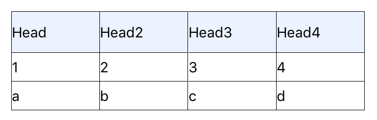
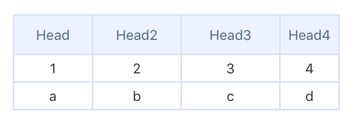
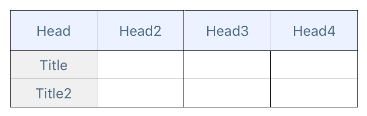
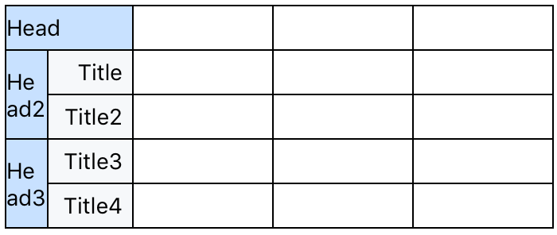
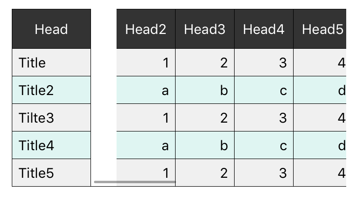

# React Native Easy Table
- [Examples](#Examples)
  - Example1
  - Example2
  - Example3
  - Example4
  - Example5
- [Properties](#Properties)
<br/><br/>

## Examples

#### Example1
> 
> 
  ```jsx
  import React, { Component } from "react";
  import { View, StyleSheet } from "react-native";
  import { Table, TableWraper, Row, Rows, Col, Cols, Cell } from '../utils/table';

  class tableView extends Component {
    render() {
      const tableHead = ['Head', 'Head2', 'Head3', 'Head4'];
      const tableData = [
        ['1', '2', '3', '4'],
        ['a', 'b', 'c', 'd'],
      ];
    
      return (
        <View>
          <Table>
            <Row data={tableHead} style={styles.head}/>
            <Rows data={tableData} style={styles.body}/>
          </Table>
        </View>
      )
    }
  }

  const styles = StyleSheet.create({
    head: { height: 40, backgroundColor: '#ecf2ff' },
    body: { height: 28 }
  })
  ```

---

#### Example2
> 
  ```jsx
  import React, { Component } from "react";
  import { View, StyleSheet } from "react-native";
  import { Table, TableWraper, Row, Rows, Col, Cols, Cell } from '../utils/table';

  class tableView extends Component {
    render() {
      const tableHead = ['Head', 'Head2', 'Head3', 'Head4'];
      const tableData = [
        ['1', 'a'],
        ['2', 'b'],
        ['3', 'c'],
        ['4', 'd']
      ]
    
      return (
        <View>
          <Table style={styles.table} borderStyle={{borderWidth: 1.5, borderColor: '#dadff2'}}>
            <Row data={tableHead} style={styles.head} textStyle={styles.text} flexArr={[1,2,1,2]}/>
            <Cols data={tableData} textStyle={styles.bodyText} heightArr={[28,50]} flexArr={[1,2,1,2]}/>
          </Table>
        </View>
      )
    }
  }

  const styles = StyleSheet.create({
    table: { marginTop: 50 },
    head: { height: 40, backgroundColor: '#ecf2ff' },
    body: { height: 28 },
    text: { color: '#4e687f', textAlign: 'center' },
    bodyText: { color: '#333', textAlign: 'center' }
  })
  ```

---

#### Example3
> 
  ```jsx
  import React, { Component } from "react";
  import { View, StyleSheet } from "react-native";
  import { Table, TableWraper, Row, Rows, Col, Cols, Cell } from '../utils/table';

  class tableView extends Component {
    render() {
      const tableHead = ['Head', 'Head2', 'Head3', 'Head4'];
      const tableTitle = ['Title', 'Title2'];
      const tableData = [
        ['', '', ''],
        ['', '', ''],
      ];
      return (
        <View>
          <Table>
            <Row data={tableHead} style={styles.head} textStyle={styles.text}/>
            <TableWraper style={{flexDirection: 'row'}}>
              <Col data={tableTitle} style={styles.title} heightArr={[28,28]} textStyle={styles.text}/>
              <Rows data={tableData} flexArr={[1,1,1]} style={styles.body}/>
            </TableWraper>
          </Table>
        </View>
      )
    }
  }

  const styles = StyleSheet.create({
    head: { height: 40, backgroundColor: '#ecf2ff' },
    title: { flex: 1 backgroundColor: '#f0f0f0' },
    body: { height: 28 },
    text: { color: '#4e687f', textAlign: 'center' }
  })
  ```

---

#### Example4
> 
  ```jsx
  import React, { Component } from "react";
  import { View, StyleSheet } from "react-native";
  import { Table, TableWraper, Row, Rows, Col, Cols, Cell } from '../utils/table';

  class tableThreeView extends Component {
    render() {
      const tableData = [
        ['', '', ''],
        ['', '', ''],
        ['', '', ''],
        ['', '', ''],
        ['', '', ''],
      ]
      return (
        <View style={style.con}>
          <Table style={{flexDirection: 'row'}} borderStyle={{borderWidth: 1, borderColor: '#333' }}>
            {/* Left wraper */}
            <TableWraper style={{width: 80}}>
              <Cell data="Head" style={styles.singleHead}/>
              <TableWraper style={{flexDirection: 'row'}}>
                <Col data={['Head2', 'Head3']} style={styles.head} heightArr={[56, 56]}/>
                <Col data={['Title', 'Title2', 'Title3', 'Title4']} style={styles.title} heightArr={[28, 28, 28, 28]} textStyle={styles.text}></Col>
              </TableWraper>
            </TableWraper>

            {/* Right wraper */}
            <TableWraper style={{flex:1}}>
              <Rows data={tableData} style={{height: 28}}/>
            </TableWraper>
          </Table>
        </View>
      )
    }
  }

  const styles = StyleSheet.create({
    singleHead: { width: 80, height: 28, backgroundColor: '#ecf2ff' },
    head: { flex: 1, backgroundColor: '#ecf2ff' },
    title: { flex: 2, backgroundColor: '#f0f0f0' },
    text: { marginRight: 6, textAlign:'right' }
  });
  ```

---

#### Example5
> 
  ```jsx
  import React, { Component } from "react";
  import { View, StyleSheet, ScrollView } from "react-native";
  import { Table, TableWraper, Row, Rows, Col, Cols, Cell } from '../utils/table';

  class tableFourView extends Component {
    render() {
      const tableHead = ['Head2', 'Head3', 'Head4', 'Head5', 'Head6', 'Head7', 'Head8', 'Head9', 'Head10','Head11'];
      const tableTitle = ['Title', 'Title2', 'Tilte3', 'Title4', 'Title5'];
      const tableData = [
        [1 ,2, 3, 4, 5, 6, 7, 8, 9, 10],
        ['a', 'b', 'c', 'd', 'e', 'f', 'g', 'h', 'i', 'j'],
        [1 ,2, 3, 4, 5, 6, 7, 8, 9, 10],
        ['a', 'b', 'c', 'd', 'e', 'f', 'g', 'h', 'i', 'j'],
        [1 ,2, 3, 4, 5, 6, 7, 8, 9, 10],
      ];
      const widthArr = [60, 60, 60, 60, 60, 60, 60, 60, 60, 60];

      return (
        <View style={style.con}>
          <Table style={styles.table} borderStyle={{borderWidth: 1,borderColor: '#000',}}>
            {/* Left wraper */}
            <TableWraper style={{width: 80}}>
              <Cell data="Head" style={styles.head} textStyle={styles.headText}/>
              {
                tableTitle.map((title, i) => <Cell key={i} data={title} height={28} style={[styles.title, i%2 && {backgroundColor: '#DFF5F2'}]} textStyle={styles.titleText}/>)
              }
            </TableWraper>

            {/* Right scrollview wraper */}
            <ScrollView horizontal={true}>
              {/* If parent element is not table element, you should add the type of borderstyle. */}
              <TableWraper borderStyle={{borderWidth: 1,borderColor: '#000',}}>
                <Row data={tableHead} style={styles.head} textStyle={styles.headText} widthArr={widthArr}/>
                {
                  tableData.map((data, i) => <Row key={i} data={data} style={[styles.list, i%2 && {backgroundColor: '#DFF5F2'}]} textStyle={styles.listText} widthArr={widthArr}/>)
                }
              </TableWraper>
            </ScrollView>
          </Table>
        </View>
      )
    }
  }

  const styles = StyleSheet.create({
    table: { width: 340, flexDirection: 'row' },
    border: { borderWidth: 1, borderColor: '#DFF5F2' },
    head: { backgroundColor: '#333', height: 40 },
    headText: { color: '#fff', textAlign: 'center' },
    title: { height: 28, backgroundColor: '#f0f0f0' },
    titleText: { marginLeft: 6 },
    list: { height: 28, backgroundColor: '#f0f0f0' },
    listText: { textAlign: 'right', marginRight: 6 }
  })
  ```
<br/><br/>

## Properties
| Prop              | Type  | Description | Default |
|---|---|---|---|
| <b>data</b>       | Array | Table data. | `null` |
| <b>style</b>      | Style | Container style. | `null` |
| <b>borderStyle</b>| Object| Table border line width and color. | `{ borderWidth: 1, borderColor: #000 }` |
| <b>textStyle</b>  | Style | Cell font style. | `null` |
| <b>flexArr</b>    | Array | Flex value per column. | `[]` |
| <b>widthArr</b>   | Array | Width per column. | `[]` |
| <b>heightArr</b>  | Array | Height per line. | `[]` |
